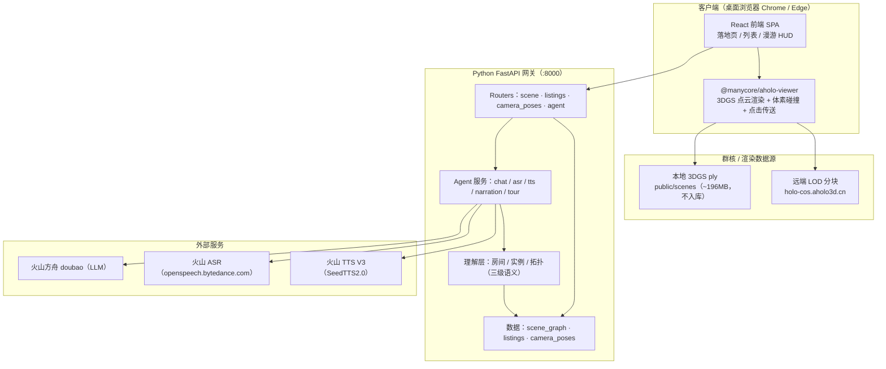
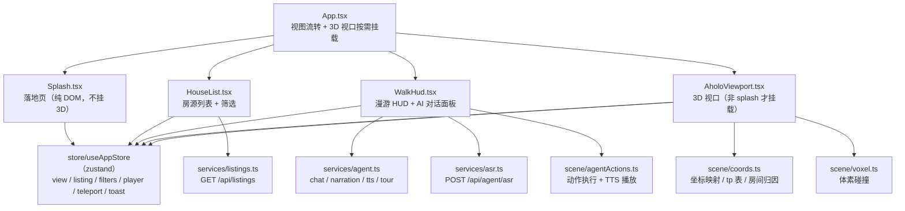
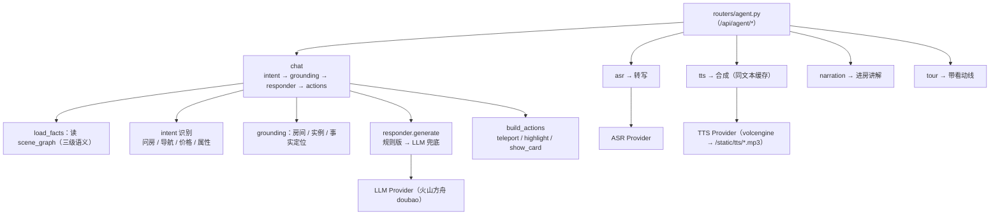
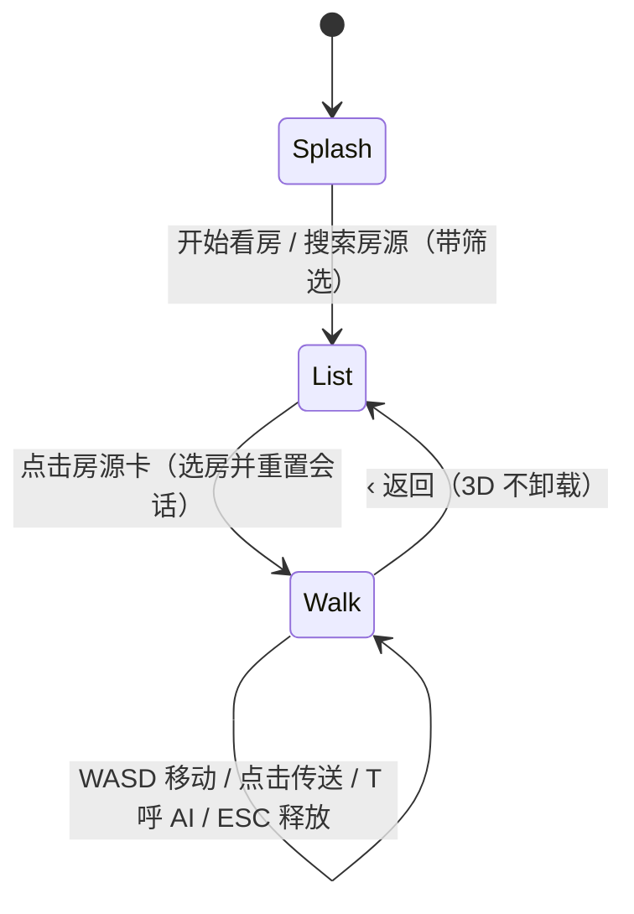
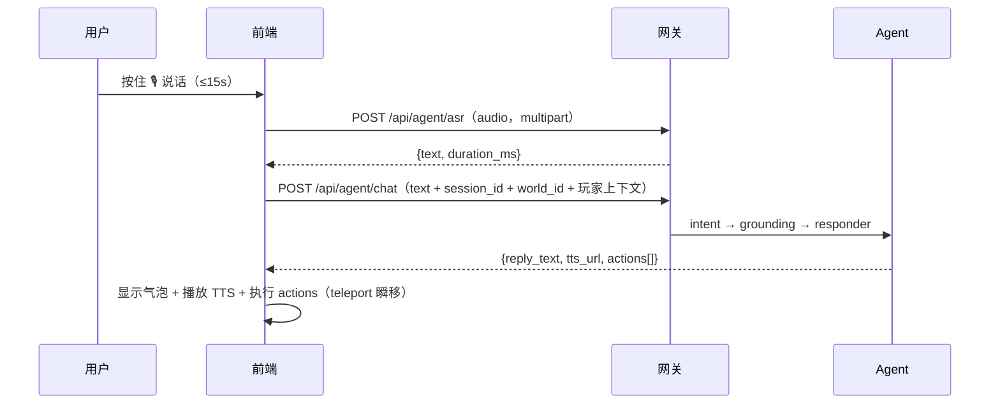

# 产品架构图（每一级）

> 「AI 代看房 · VentureD」的分层架构图，按粒度从大到小共五级：系统总架构 → 前端模块 → 后端 Agent → 页面/状态流转 → 数据流时序。
> 图表用 Mermaid 绘制，GitHub / 支持 Mermaid 的编辑器里会直接渲染。日期：2026-08-28。

---

## 1. 系统总架构（一级）

要点：前端只跟网关 + 群核 viewer 打交道；Agent 能力内聚在 Python 网关里；外部只依赖 LLM / ASR / TTS 三个服务；点云数据走本地文件或群核 CDN，不入 git。

---

## 2. 前端模块架构（二级）

要点：`useAppStore` 是唯一状态中枢——组件只读 store，逻辑只写 store（UI 与数据流解耦）；3D 视口、坐标、体素是独立模块。

---

## 3. 后端 Agent 架构（三级）

要点：chat 是 P0 主链路；话术必须基于 scene_graph 事实，不编造；导航 / 价格口径锁定，不走 LLM 改写。

---

## 4. 页面 / 状态流转（四级）

---

## 5. 数据流时序（五级）· 一次语音问答

---

## 附：降级矩阵（任一环节缺失，demo 不挂）

| 缺失项 | 降级 |
|---|---|
| 后端 chat 不可达 | 前端报「Agent 暂不可用」，不阻塞漫游 |
| asr 失败 / 空语音 | 打字输入 / 提示「没听清」 |
| tts / tts_url 缺失 | 前端本地 TTS 或静音气泡 |
| 点云未就绪 | 房间 HUD / 对话仍工作；渲染提示加载进度 |
| 坐标对拍缺失 | room_id=null，agent 只输出文本 / tp_id |
